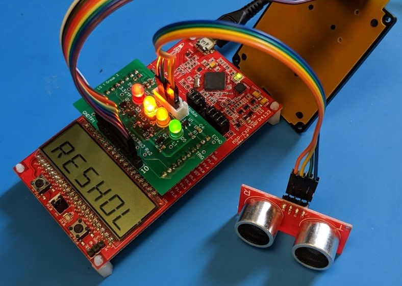

# Bike-Safe
#### Embedded system, built on the TI MSP430, that detects and warns drivers of incoming objects



Source for the project can be found in ```LED_BLINKER/blink.c```

#### Operation 

1. An ultrasonic distance sensor is used to measure distances of incoming objects, with the distance of the closest object displayed on the LCD in real time.
2. The keypad is used to enter threshold distances. These distances determine the level of "safety" of the specified distances. The levels include: Danger, Warning, Moderate, and Safe.
3. LED's corresponding to these threshold distances light up depending on the current distance.

#### Demo


